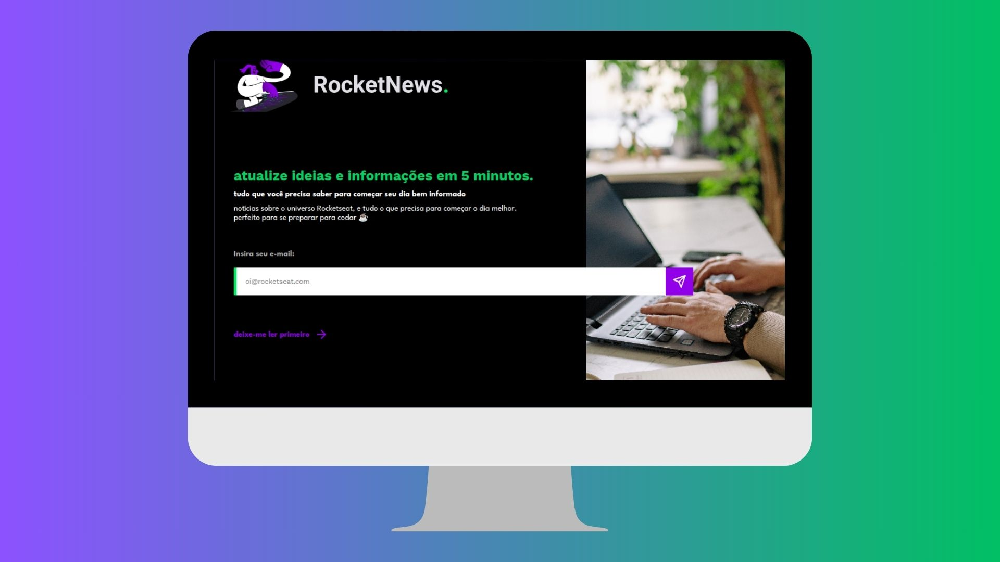

<h1 align="center"> DevNews </h1>

Desafio Discover, promovido pela Rocketseat para ensino de tecnologias WEB.  

  <a href="#-tecnologias">Tecnologias</a>&nbsp;&nbsp;&nbsp;|&nbsp;&nbsp;&nbsp;
  <a href="#-projeto">Projeto</a>&nbsp;&nbsp;&nbsp;|&nbsp;&nbsp;&nbsp;
  <a href="#-layout">Layout</a>&nbsp;&nbsp;&nbsp;|&nbsp;&nbsp;&nbsp;
  <a href="#memo-licença">Licença</a>

  

 

  

## 🚀 Tecnologias

Esse projeto foi desenvolvido com as seguintes tecnologias:

- HTML e CSS
- Git e Github
- Figma

## 💻 Projeto

O DevNews é uma página para captação de leads ou newsletter.

Você pode visualizar o site através
<a href="https://biankaaraujo.github.io/devnews/" target="_blank">DESSE LINK</a>.

## 🔖 Layout

Você pode visualizar o layout do projeto através
<a href="https://www.figma.com/community/file/1241119530230478440" target="_blank">DESSE LINK</a>. É necessário ter conta no
<a href="https://figma.com" target="_blank">Figma</a> para acessá-lo.

## :memo: Licença

Esse projeto está sob a licença MIT.

---

By Bianka Araujo
